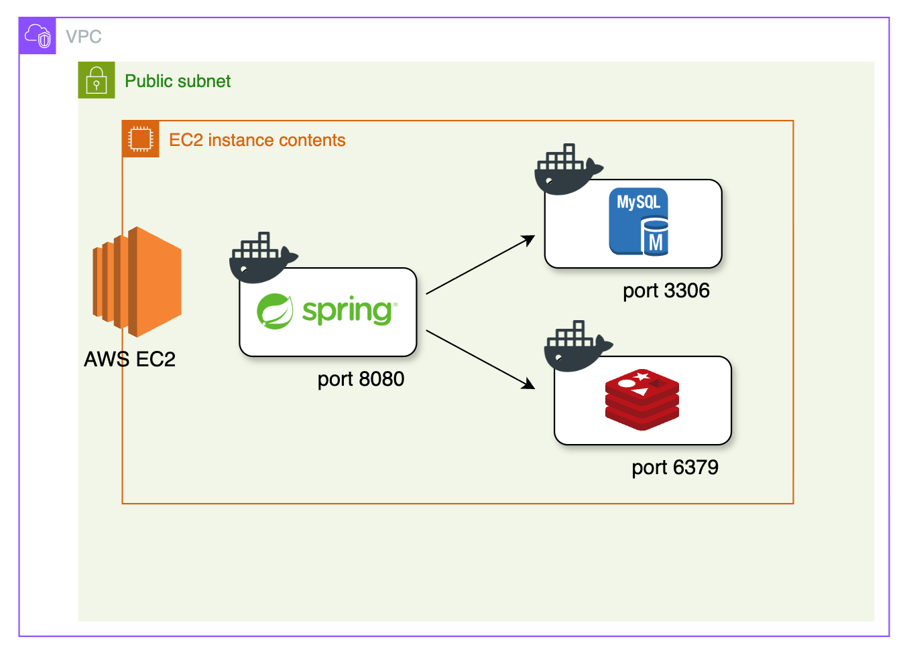
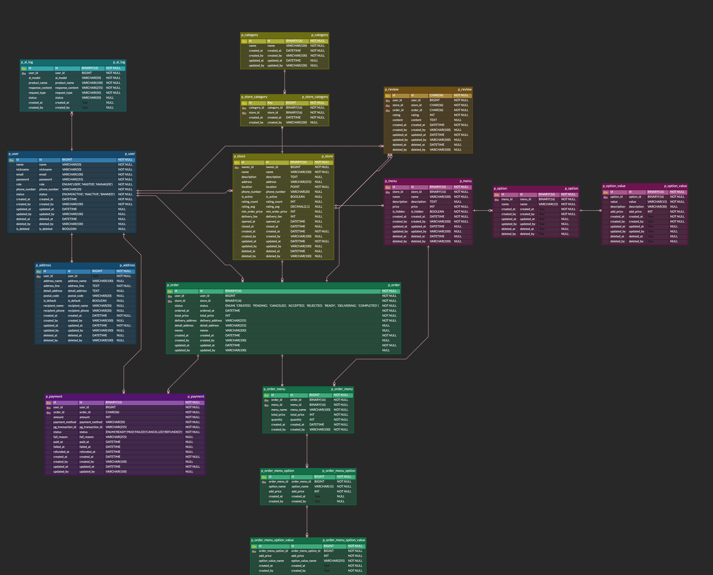

# 1. 팀 소개

팀 이름 : **9글링 개발팀**

프로젝트 명 : 음식 주문 서비스

소개

- 한 줄 정리 : 음식점들의 배달 주문을 쉽고 빠르게 관리하는 플랫폼
- 내용 : 사용자는 음식점을 검색하고 메뉴를 선택하여 주문할 수 있으며, 음식점은 주문 내역과 결제 상태를 확인할 수 있습니다.

## 1.1. 팀원 역할 분담

도상원

- 인증, 사용자 도메인 개발
- 배포 담당

유민아

- 상품, 상품 상세 옵션 도메인 개발
- README 작성

이원규

- AI 연동 개발
- 발표 담당

정민지

- 가게 도메인 개발
- PPT 작성

조유리

- 주문 도메인 개발
- README 작성

차준호

- 결제 도메인 개발
- 리뷰 도메인 개발

# 2. 서비스 구성

## 2.1. 인프라, 기술 스택

- Java 17(LTS)
- Spring Boot 3.4.10
- Mysql 8.x
- Redis 7.x
- Spring Data JPA
- Spring Security
- Swagger
- Docker
- AWS

## 2.2. ERD

[🔗 ERD 링크](https://www.erdcloud.com/d/JHFDM8y4GuoN9zpaE)

## 2.3. 실행 방법

#### 배포 서버 사용하기

[🔗 배포서버 링크](https://www.erdcloud.com/d/JHFDM8y4GuoN9zpaE)

#### docker-compose 로 실행하는 방법

1. 프로젝트 압축 해제
2. `cd docker`
3. `docker compose -f docker-compose.local.yml up -d`
4. `cd ..`
5. `./gradlew clean build`
6. `java -jar build/libs/foodorder-0.0.1-SNAPSHOT.jar`

## 2.4. 버전 관리 규칙

### branch 생성 규칙

깃허브에서 issue를 발행하고, `feature/issue 번호`로 브랜치를 생성한다.

### Commit/PR 접두사 규칙

- `feature`: 새로운 기능 추가
- `refactor`: 기능이나 동작은 변경하지 않지만, 코드의 가독성, 유지보수성 등을 향상하기 위해 코드를 수정
    - 함수나 메서드를 더 작은 단위로 분리
    - 변수 이름을 명확하게 변경
    - 중복 코드를 제거하는 등의 작업
- `test`: 테스트 코드 추가
- `fix`: 버그 수정
- `infra`: 시스템의 기본 구조와 운영 환경을 설정
- `docs`: 문서 수정
- `style`: 코드 포맷팅등 코드 변경이 없는 경우
    - 줄바꿈, 공백을 정리 등
- `chore`: 프로젝트 구조 변경
    - 빌드 업무 수정, 패키지 매니저 수정 등
- `merge`: 브랜치 병합, 병합 충돌 해결
