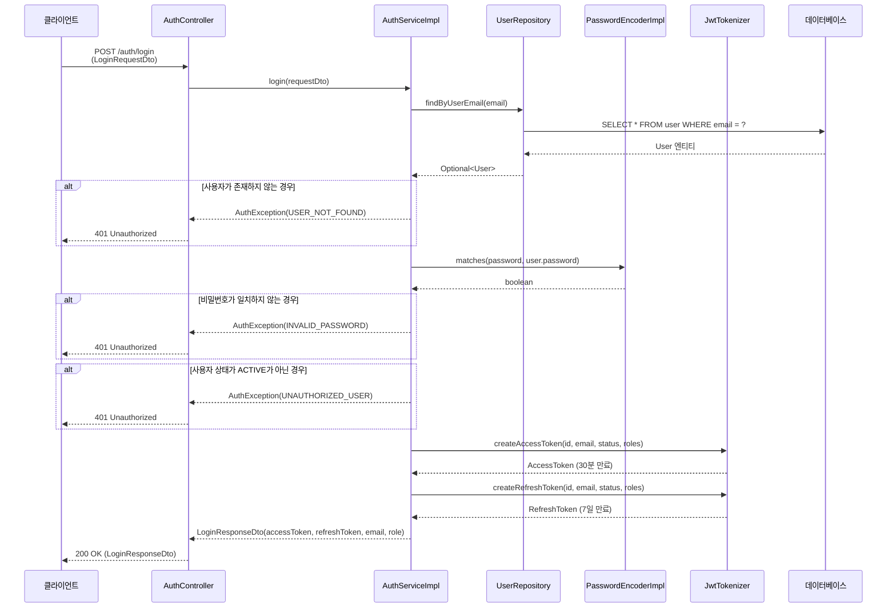
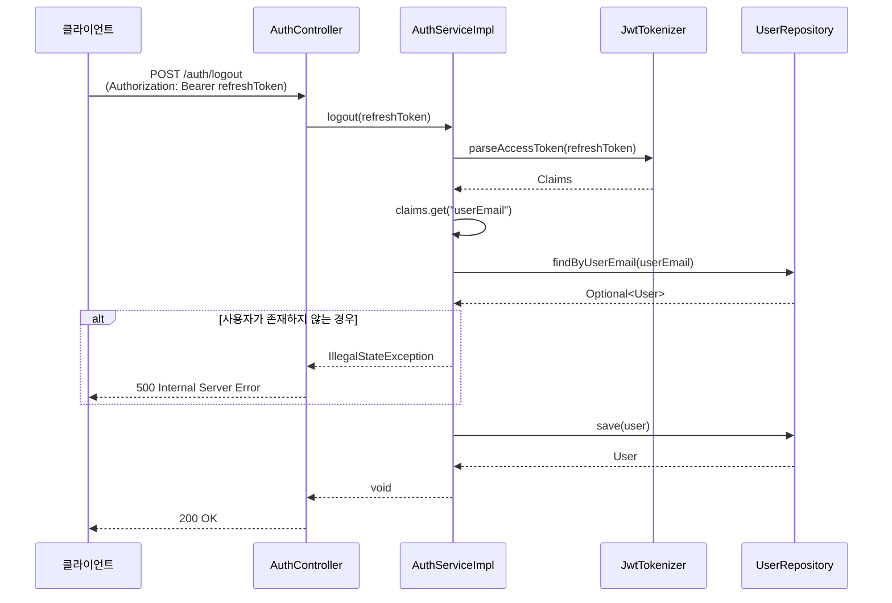
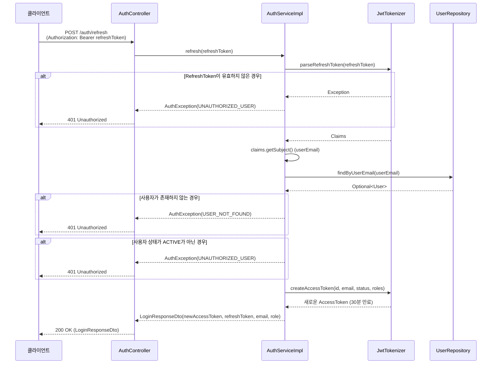
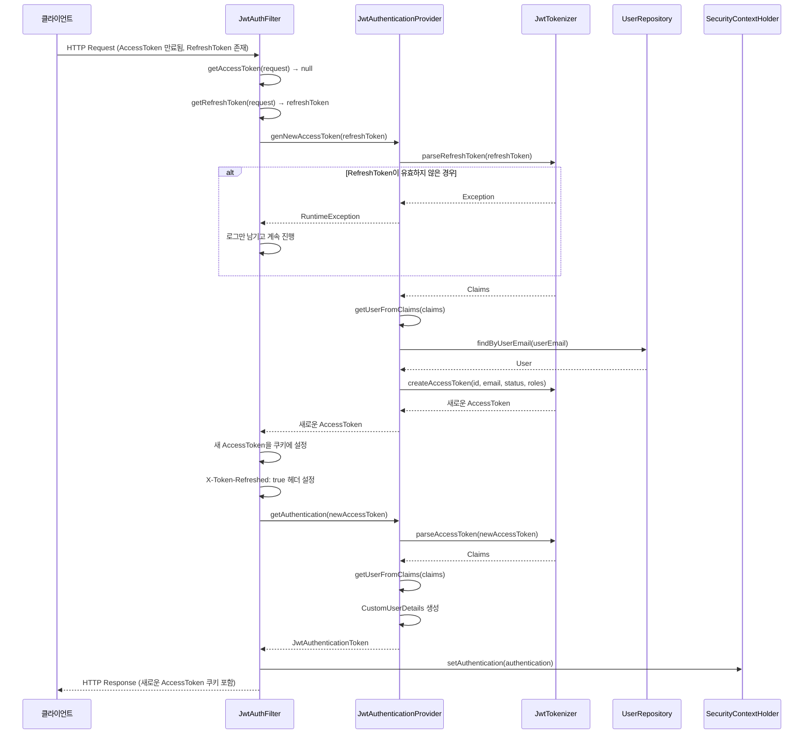
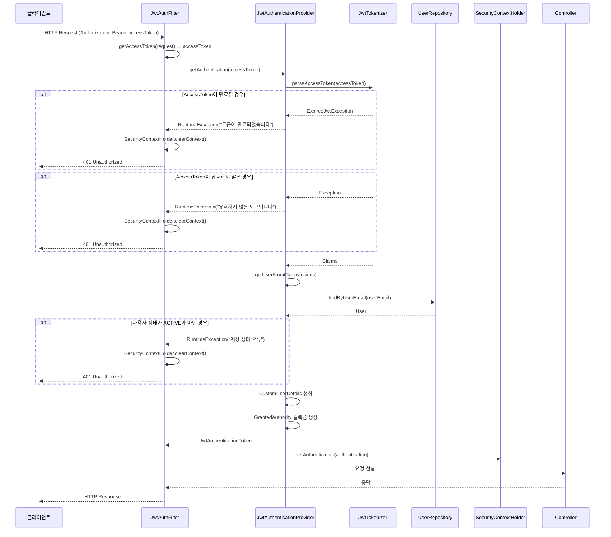

# JWT 인증 시스템 시퀀스 다이어그램

## 1. 로그인 시퀀스

## 2. 로그아웃 시퀀스

## 3. 토큰 갱신 시퀀스

## 4. 토큰 만료 시 자동 갱신 시퀀스 (JwtAuthFilter)

## 5. 인증이 필요한 API 접근 시퀀스

## 주요 컴포넌트 설명

### 1. JwtTokenizer

- **역할**: JWT 토큰 생성, 파싱, 검증
- **주요 메서드**:
  - `createAccessToken()`: AccessToken 생성 (30분 만료)
  - `createRefreshToken()`: RefreshToken 생성 (7일 만료)
  - `parseAccessToken()`: AccessToken 파싱 및 검증
  - `parseRefreshToken()`: RefreshToken 파싱 및 검증

### 2. AuthServiceImpl

- **역할**: 인증 비즈니스 로직 처리
- **주요 메서드**:
  - `login()`: 로그인 처리 및 토큰 발급
  - `logout()`: 로그아웃 처리
  - `refresh()`: RefreshToken으로 새로운 AccessToken 발급

### 3. JwtAuthenticationProvider

- **역할**: JWT 기반 인증 처리
- **주요 메서드**:
  - `getAuthentication()`: AccessToken으로 Authentication 객체 생성
  - `genNewAccessToken()`: RefreshToken으로 새로운 AccessToken 생성
  - `getUserFromClaims()`: JWT 클레임에서 User 정보 추출 및 상태 검증

### 4. JwtAuthFilter

- **역할**: HTTP 요청 필터링 및 자동 토큰 갱신
- **주요 기능**:
  - 인증이 필요 없는 경로 스킵
  - AccessToken 만료 시 RefreshToken으로 자동 갱신
  - SecurityContext에 인증 정보 설정

### 5. 토큰 만료 시간

- **AccessToken**: 30분 (1000 _ 60 _ 30L)
- **RefreshToken**: 7일 (7 _ 24 _ 60 _ 60 _ 1000L)

### 6. 사용자 상태 검증

- **ACTIVE**: 정상 사용자
- **INACTIVE**: 비활성화된 계정
- **PENDING**: 승인 대기 중
- **BANNED**: 제재된 계정
- **WITHDRAWN**: 탈퇴한 계정
