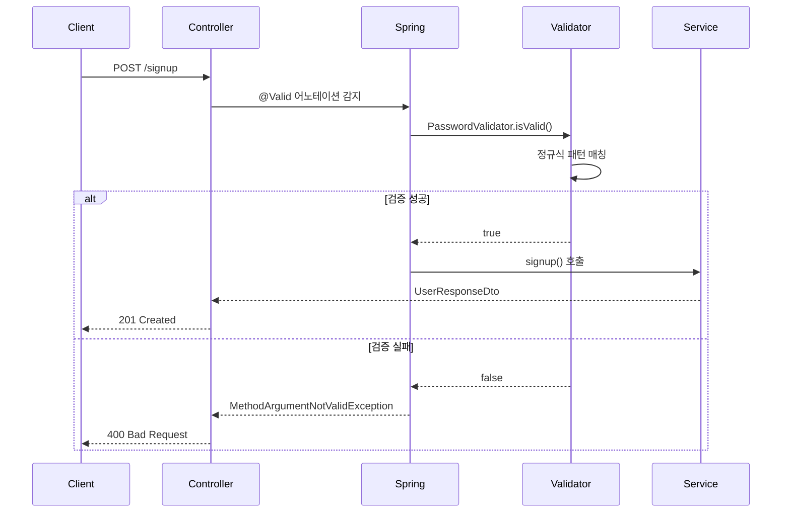

# 커스텀 검증 어노테이션 가이드

## 📋 목차

1. [JavaDoc이란?](#javadoc이란)
2. [런타임 어노테이션 정보 유지](#런타임-어노테이션-정보-유지)
3. [어노테이션 메타데이터 상세 설명](#어노테이션-메타데이터-상세-설명)
4. [ConstraintValidator 인터페이스](#constraintvalidator-인터페이스)
5. [실제 사용 예시](#실제-사용-예시)
6. [검증 동작 과정](#검증-동작-과정)

---

## JavaDoc이란?

### 📖 정의

**JavaDoc**은 Java 코드의 문서화를 위한 표준 도구입니다. 특별한 주석 형식을 사용하여 클래스, 메서드, 필드에 대한 설명을 작성하고, 이를 HTML 문서로 변환할 수 있습니다.

### 🔧 JavaDoc 주석 형식

```java
/**
 * 클래스나 메서드에 대한 설명
 *
 * @param 매개변수 설명
 * @return 반환값 설명
 * @throws 예외 설명
 * @author 작성자
 * @since 버전
 */
```

### 💡 우리 코드에서의 JavaDoc

```java
/**
 * 비밀번호 정책 검증 어노테이션
 * - 최소 8자 이상
 * - 영문, 숫자, 특수문자 조합
 */
@Target({ElementType.FIELD, ElementType.PARAMETER})
@Retention(RetentionPolicy.RUNTIME)
@Constraint(validatedBy = PasswordValidator.class)
@Documented  // ← 이 어노테이션이 JavaDoc에 포함되도록 함
public @interface ValidPassword {
    // ...
}
```

### 🎯 JavaDoc의 장점

- **자동 문서화**: 코드 변경 시 문서도 자동 업데이트
- **IDE 지원**: IntelliJ, Eclipse에서 툴팁으로 표시
- **API 문서 생성**: 웹사이트 형태로 배포 가능

---

## 런타임 어노테이션 정보 유지

### 🔍 Retention Policy란?

Java 어노테이션은 **언제까지 정보를 유지할지**를 결정하는 `@Retention` 어노테이션을 사용합니다.

### 📊 Retention Policy 종류

#### 1. `RetentionPolicy.SOURCE`

```java
@Retention(RetentionPolicy.SOURCE)
public @interface SourceAnnotation {
    // 컴파일 시점에만 존재
    // .class 파일에 포함되지 않음
}
```

- **언제**: 컴파일 시점에만 존재
- **용도**: 컴파일러 힌트, 코드 생성 도구
- **예시**: `@Override`, `@SuppressWarnings`

#### 2. `RetentionPolicy.CLASS` (기본값)

```java
@Retention(RetentionPolicy.CLASS)
public @interface ClassAnnotation {
    // .class 파일에는 포함되지만 런타임에는 접근 불가
}
```

- **언제**: .class 파일에는 포함, 런타임에는 접근 불가
- **용도**: 바이트코드 분석 도구

#### 3. `RetentionPolicy.RUNTIME` ⭐

```java
@Retention(RetentionPolicy.RUNTIME)
public @interface RuntimeAnnotation {
    // 런타임에도 접근 가능
}
```

- **언제**: 런타임에도 접근 가능
- **용도**: 리플렉션, 검증 프레임워크

### 🎯 왜 RUNTIME이 필요한가?

```java
// Spring Boot가 런타임에 이렇게 동작
@RestController
public class UserController {

    @PostMapping("/signup")
    public ResponseEntity<UserResponseDto> signup(
        @Valid @RequestBody SignupRequestDto request) {  // ← 런타임에 @Valid 검증

        // Spring이 런타임에 다음을 수행:
        // 1. SignupRequestDto의 필드들을 스캔
        // 2. @ValidPassword 어노테이션 발견
        // 3. PasswordValidator.isValid() 호출
        // 4. 검증 실패 시 예외 발생
    }
}
```

**만약 RUNTIME이 아니라면?**

- Spring이 어노테이션을 찾을 수 없음
- 검증이 실행되지 않음
- 런타임 에러 발생

---

## 어노테이션 메타데이터 상세 설명

### 🎯 선택된 코드 분석

```java
String message() default "비밀번호는 최소 8자 이상이며, 영문, 숫자, 특수문자를 포함해야 합니다";

Class<?>[] groups() default {};

Class<? extends Payload>[] payload() default {};
```

### 📝 각 요소 상세 설명

#### 1. `message()` 메서드

```java
String message() default "비밀번호는 최소 8자 이상이며, 영문, 숫자, 특수문자를 포함해야 합니다";
```

**역할**: 검증 실패 시 표시될 에러 메시지

**사용 예시**:

```java
@ValidPassword(message = "커스텀 에러 메시지")
private String password;

// 또는 기본 메시지 사용
@ValidPassword  // 기본 메시지 사용
private String password;
```

**Bean Validation에서의 활용**:

```java
// 검증 실패 시 MethodArgumentNotValidException 발생
// GlobalExceptionHandler에서 처리
@ExceptionHandler(MethodArgumentNotValidException.class)
public ResponseEntity<ErrorResponse> handleValidationException(
    MethodArgumentNotValidException ex) {

    // message()에서 정의한 메시지가 여기서 사용됨
    String errorMessage = ex.getBindingResult()
        .getFieldError()
        .getDefaultMessage();  // ← message() 값
}
```

#### 2. `groups()` 메서드

```java
Class<?>[] groups() default {};
```

**역할**: 검증 그룹을 정의하여 상황별로 다른 검증 규칙 적용

**사용 예시**:

```java
// 그룹 인터페이스 정의
public interface CreateGroup {}
public interface UpdateGroup {}

// 어노테이션에서 그룹 사용
@ValidPassword(groups = {CreateGroup.class})
private String password;

// 서비스에서 그룹별 검증
@Validated(CreateGroup.class)  // CreateGroup만 검증
public void createUser(SignupRequestDto dto) {}

@Validated(UpdateGroup.class)  // UpdateGroup만 검증
public void updateUser(UpdateRequestDto dto) {}
```

**현재 프로젝트에서는**: 빈 배열 `{}`로 설정하여 모든 상황에서 검증

#### 3. `payload()` 메서드

```java
Class<? extends Payload>[] payload() default {};
```

**역할**: 검증 실패 시 추가 메타데이터 전달

**사용 예시**:

```java
// Payload 인터페이스 정의
public interface Severity {
    interface Info extends Payload {}
    interface Warning extends Payload {}
    interface Error extends Payload {}
}

// 어노테이션에서 사용
@ValidPassword(payload = {Severity.Error.class})
private String password;

// 검증 실패 시 심각도 정보 활용
ConstraintViolation<SignupRequestDto> violation = ...;
if (violation.getConstraintDescriptor().getPayload().contains(Severity.Error.class)) {
    // 에러 레벨 처리
    log.error("심각한 검증 오류: {}", violation.getMessage());
}
```

**현재 프로젝트에서는**: 빈 배열 `{}`로 설정하여 기본 동작

---

## ConstraintValidator 인터페이스

### 🔧 인터페이스 구조

```java
public interface ConstraintValidator<A extends Annotation, T> {
    void initialize(A constraintAnnotation);
    boolean isValid(T value, ConstraintValidatorContext context);
}
```

### 📊 제네릭 타입 설명

#### `ConstraintValidator<ValidPassword, String>`

```java
public class PasswordValidator implements ConstraintValidator<ValidPassword, String> {
    // ValidPassword: 검증할 어노테이션 타입
    // String: 검증할 값의 타입
}
```

**타입 매개변수**:

- **첫 번째 (`ValidPassword`)**: 어떤 어노테이션을 처리할지
- **두 번째 (`String`)**: 어떤 타입의 값을 검증할지

#### `ConstraintValidator<ValidKoreanOrEnglishName, String>`

```java
public class KoreanOrEnglishNameValidator implements ConstraintValidator<ValidKoreanOrEnglishName, String> {
    // ValidKoreanOrEnglishName: 검증할 어노테이션 타입
    // String: 검증할 값의 타입
}
```

### 🔄 메서드 생명주기

#### 1. `initialize()` 메서드

```java
@Override
public void initialize(ValidPassword constraintAnnotation) {
    // 어노테이션 인스턴스 생성 시 한 번만 호출
    // 어노테이션의 속성값들을 초기화
    String customMessage = constraintAnnotation.message();
    // 정규식 패턴 등을 미리 컴파일
}
```

**호출 시점**: Validator 인스턴스 생성 시
**용도**: 어노테이션 속성값 읽기, 정규식 패턴 컴파일 등

#### 2. `isValid()` 메서드

```java
@Override
public boolean isValid(String password, ConstraintValidatorContext context) {
    // 실제 검증 로직 수행
    // 매번 호출됨
    return PASSWORD_PATTERN.matcher(password).matches();
}
```

**호출 시점**: 검증이 필요한 때마다
**매개변수**:

- `String password`: 검증할 실제 값
- `ConstraintValidatorContext`: 검증 컨텍스트 (에러 메시지 커스터마이징 등)

### 🎯 실제 동작 과정

```java
// 1. Spring Boot 시작 시
PasswordValidator validator = new PasswordValidator();
validator.initialize(validPasswordAnnotation);  // initialize() 호출

// 2. API 요청 시마다
@PostMapping("/signup")
public ResponseEntity<?> signup(@Valid @RequestBody SignupRequestDto dto) {
    // Spring이 내부적으로 수행:
    String password = dto.getPassword();
    boolean isValid = validator.isValid(password, context);  // isValid() 호출

    if (!isValid) {
        throw new MethodArgumentNotValidException(...);
    }
}
```

---

## 실제 사용 예시

### 📝 DTO에서의 사용

```java
public class SignupRequestDto {

    @NotBlank(message = "이름은 필수입니다")
    @Size(min = 2, max = 50, message = "이름은 2자 이상 50자 이하여야 합니다")
    @ValidKoreanOrEnglishName  // ← 커스텀 검증
    private String name;

    @NotBlank(message = "비밀번호는 필수입니다")
    @ValidPassword  // ← 커스텀 검증
    private String password;

    // getter, setter...
}
```

### 🎮 Controller에서의 사용

```java
@RestController
@RequestMapping("/v1/users")
public class UserController {

    @PostMapping
    public ResponseEntity<UserResponseDto> signup(
        @Valid @RequestBody SignupRequestDto request) {  // ← @Valid로 검증 활성화

        UserResponseDto response = userService.signup(request);
        return ResponseEntity.status(HttpStatus.CREATED).body(response);
    }
}
```

### ⚠️ 검증 실패 시 응답

```json
{
  "timestamp": "2024-01-15T10:30:00",
  "status": 400,
  "error": "Bad Request",
  "message": "Validation failed",
  "errors": [
    {
      "field": "password",
      "message": "비밀번호는 최소 8자 이상이며, 영문, 숫자, 특수문자를 포함해야 합니다"
    },
    {
      "field": "name",
      "message": "이름은 한글 또는 영문만 입력 가능합니다"
    }
  ]
}
```

---

## 검증 동작 과정

### 🔄 전체 플로우



### 📋 단계별 상세 과정

#### 1단계: 요청 수신

```java
@PostMapping
public ResponseEntity<UserResponseDto> signup(
    @Valid @RequestBody SignupRequestDto request) {
    // Spring이 @Valid 어노테이션을 감지
}
```

#### 2단계: 어노테이션 스캔

```java
// Spring 내부 동작 (의사코드)
for (Field field : SignupRequestDto.class.getDeclaredFields()) {
    Annotation[] annotations = field.getAnnotations();
    for (Annotation annotation : annotations) {
        if (annotation instanceof ValidPassword) {
            // PasswordValidator 찾기
            Validator validator = getValidator(PasswordValidator.class);
            validator.isValid(field.getValue(), context);
        }
    }
}
```

#### 3단계: 검증 실행

```java
public class PasswordValidator implements ConstraintValidator<ValidPassword, String> {
    @Override
    public boolean isValid(String password, ConstraintValidatorContext context) {
        // 정규식 패턴 매칭
        return PASSWORD_PATTERN.matcher(password).matches();
    }
}
```

#### 4단계: 결과 처리

```java
// 검증 성공 시
if (isValid) {
    return userService.signup(request);
}

// 검증 실패 시
else {
    throw new MethodArgumentNotValidException(
        parameter,
        bindingResult  // 에러 메시지 포함
    );
}
```

---

## 🎯 핵심 정리

### ✅ JavaDoc

- 코드 문서화를 위한 표준 도구
- `@Documented`로 어노테이션 정보를 JavaDoc에 포함

### ✅ 런타임 어노테이션 정보 유지

- `@Retention(RetentionPolicy.RUNTIME)`으로 런타임 접근 가능
- Spring Boot가 검증 시 어노테이션 정보를 읽을 수 있음

### ✅ ConstraintValidator

- `<어노테이션타입, 검증값타입>` 제네릭으로 타입 안전성 보장
- `initialize()`: 초기화, `isValid()`: 실제 검증

### ✅ 어노테이션 메타데이터

- `message()`: 에러 메시지 정의
- `groups()`: 검증 그룹 (현재는 미사용)
- `payload()`: 추가 메타데이터 (현재는 미사용)

이러한 구조로 **재사용 가능하고 유지보수하기 쉬운** 검증 시스템을 구축할 수 있습니다! 🚀
